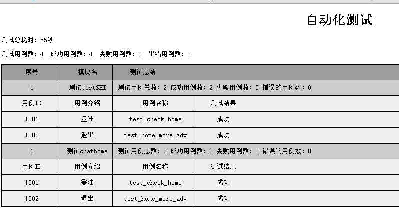

# 自动化测试平台
## 框架介绍
* 基于python3
* 基于app UI自动化，使用appium（可用于ios,和安卓）

### 模块介绍
* testBaseOpreate 通用操作，比如简单点，执行操作，读取xml(yaml配置文件)
* testCase 测试用例文件都放在这里
* testData 测试的常用数据，如枚举数据
* testMode 测试实体类
* testSetting测试框架的常用设置
* testRunner 测试运行 runner.py入口
* testReport 结果展示
	* 打算用pyh手动拼接html页面的方式
	* 测试结果导出成 Junit 格式的 xml 文件，然后用其他工具生产
	

## 2015-11-10 更新日志
* 引用yaml来配置测试案例，代替xml
* 更新了自定义日志函数
* 用例抽象化，如所有的地方只要修改testDriver.webChatHome.py 即可，其他地方无需修改

## 2016-1-19 更新日志
* 规范markdown语法

## 2016-3-25
* 更新了用例的管理，用例只许到D:\appium\testcase\module(项目模块)定义自己的用例：
* testCase目录编写相应的检查和执行操作即可
```yaml配置文件
 - element_info: com.xfb.user:id/home_fragment_arrow_left_img
   operate_type: click
   findElemtType: id
 - element_info: com.xfb.user:id/citydeals_item_title
   operate_type: null
   findElemtType: id
```
 * 第一个对象是操作
 * 第二个对象是检查点

* 结果展示优化
 * 新增截图
 * 新增调试日志和执行日志分开显示
``` 调试信息
 2016-03-25 18:03:14,098 - root - INFO - ----  test_check_home   START     ----
``` 
``` 执行日志
 test_click_home: OK
``` 
* 启动代码优化。使用setUpClass tearDownClass 代替setup,teardown。每次执行完所有case才会关闭app


## 2016-4-28 更新日志
* 更新了unittest参数化，每次只要  suite.addTest(TestInterfaceCase.parametrize(testShiBase)) 类，就可以执行这个类里面的所有case。入口变成了runner4.py

* 新增结果展示,采用的是pyh拼接的方式来生成html报告




## 2016-7-24更新日志

* 优化操作类

```
class getOperateElement():
    def __init__(self, driver=""):
        self.cts = driver
    def findElement(self, elemt_by, element_info):
        '''
        查找元素
        :param elemt_by:   查找类型,id,xpath等
        :param element_info: 具体元素参数，如xpath的值，id的值
        :return:
        '''
        try:
            WebDriverWait(self.cts, 10).until(lambda x: elements_by(elemt_by, self.cts, element_info))
            return True
        except selenium.common.exceptions.TimeoutException:
            return False
        except selenium.common.exceptions.NoSuchElementException:
            print("找不到数据")
            return False
    def operate_element(self, operate, elemen_by, element_info, *arg):
        '''
        所有的操作入口
        :param operate: 操作对应common中的click,tap等
        :param elemen_by: 对应common中的id,xpath,name等
        :param element_info: 详细的元素，如xpath的格式，如id,name的名字
        :param arg: 扩展字段传list
        :return:
        '''
        elements = {
            common.CLICK: lambda: operate_click(elemen_by, self.cts, element_info),
            common.TAP: lambda: operate_tap(elemen_by, self.cts, elemen_by, arg)
        }
        return elements[operate]()

# 点击事件
def operate_click(elemen_by,cts,element_info):
    elements_by(elemen_by, cts, element_info).click()

# 轻打x轴向右移动x单位，y轴向下移动y单位
def operate_tap(elemen_by,cts,element_info, xy=[]):
    elements_by(elemen_by, cts, element_info).tap(x=xy[0], y=xy[1])

# 封装常用的find标签
def elements_by(types, cts, element_info):
    elements = {
        common.ID : lambda :cts.find_element_by_id(element_info),
        common.XPATH: lambda :cts.find_element_by_xpath(element_info),
        common.NAME: lambda :cts.find_element_by_name(element_info)
    }
    return elements[types]()

```

# 2016-7-29 更新日志
* [封装appium-server启动](https://github.com/284772894/appiumn_auto/blob/master/testRunner/testServer.py)
* [schematics代替model层的功能](https://github.com/284772894/appiumn_auto/blob/master/testMode/BaseAppDevices.py)，完全取代传统的get set,并且还能验证字段的类型是否正确

# 2016-8-6 更新日志
* 使用命名的方式启动appium
* 优化用例编写类，以后只要改用例的yaml文件和用例case.py即可运行

```
# 这样调用用例即可
execCase(r'D:\appium\testcase\home\home_more_adv.yaml', test_id="2004", test_intr="首页广告", test_case="test_home_more_adv",isLast="1")

```

# 2016-8-26
* 更新测试报告，用excel展示
* 邮件发送测试报告


# 2016-9-5
* 三层架构重构整个系统，分为了model,dal,bll,common,testCase(主要编写用例),runner（入口）
* 更新记录内存，cpu,平均和最大峰值情况

# 2016-9-6
* 修复计算内存错误
* 优化代码解耦

# 2016-8-7
* 重构DAL调用DAL层问题，放到了common层里面去了
